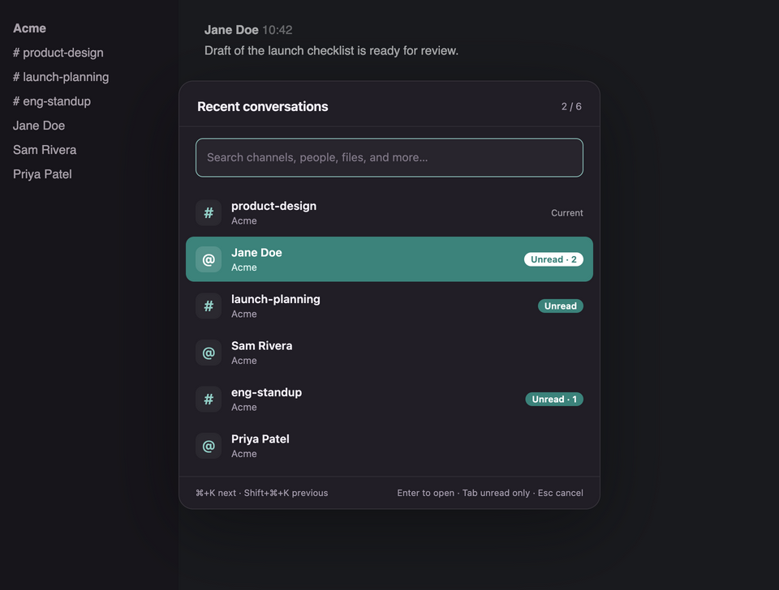
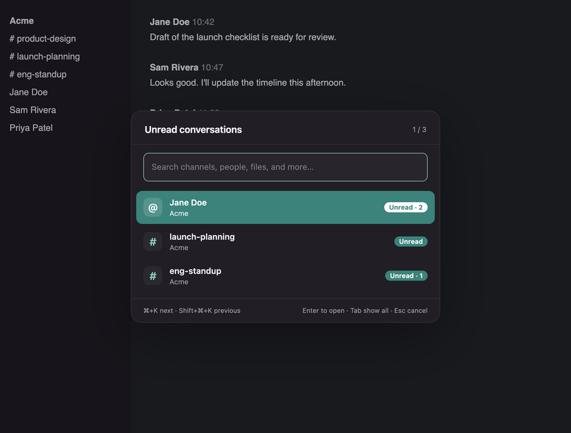
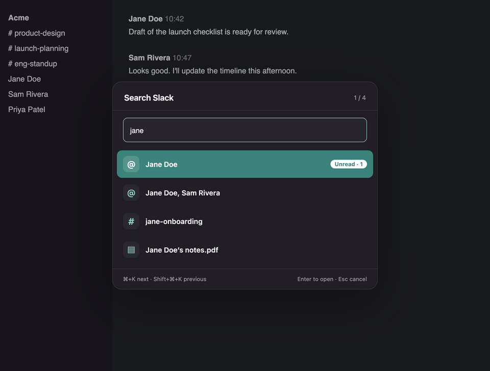
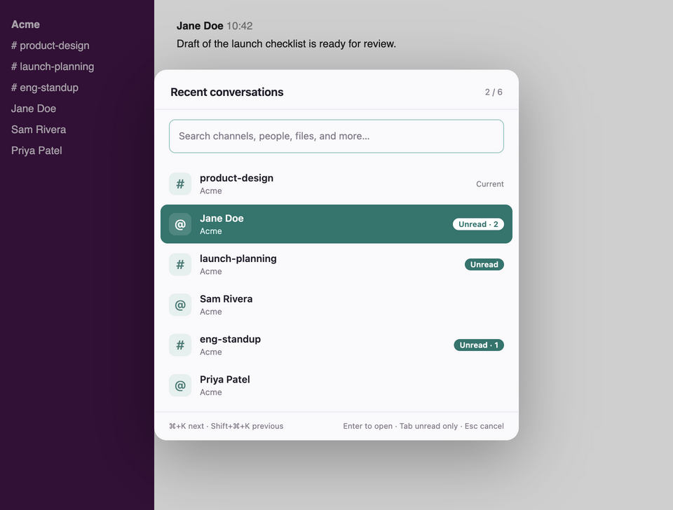

# Slack Recent Switcher

A faster way to jump between Slack conversations. Press **⌘K** (Ctrl-K on Linux and Windows) to see your recent channels and DMs, search Slack, or show only what's unread.

It's an unofficial patch applied to a copy of the Slack desktop app. Your official Slack app stays untouched.

> Not affiliated with or endorsed by Slack. Use at your own risk.

| Recent conversations | Unread only |
| --- | --- |
|  |  |

| Search | Light theme |
| --- | --- |
|  |  |

## How to use it

- **Tap ⌘K** to open the panel, then type to search Slack.
- **Hold ⌘ and press K** repeatedly to cycle through recent conversations. Let go to open one.
- **Tab** switches between all recents and unread only (current workspace).
- **Enter** opens the highlighted item. **Esc** closes the panel.

## Install

You need the official Slack desktop app and [Node.js](https://nodejs.org) 22.12 or newer.

```sh
git clone https://github.com/fazulk/slack-recent-switcher.git
cd slack-recent-switcher
npm ci
npm run install:slack
```

On macOS this creates `~/Applications/Slack Recents.app`. Open it and sign in to Slack as usual. Your recents list fills in as you visit conversations.

You can also let an agent do it: clone the repo and ask it to *"read AGENTS.md and install Slack Recents."* `AGENTS.md` also has the Linux and Windows steps and troubleshooting.

## Good to know

- Slack Recents has its own sign-in and history, separate from the official app.
- It doesn't auto-update. After Slack updates, quit Slack Recents and run `npm run install:slack` again.
- Slack links may open in Slack Recents instead of the official app.
- The patched copy isn't signed by Slack. Your computer treats it as a locally built app.
- To uninstall on macOS, delete the Slack Recents app. Delete `~/Library/Application Support/Slack Recents` too if you want to remove its sign-in and history. For Linux and Windows, see `AGENTS.md`.
- It's used day to day on macOS. Linux has had limited testing, and Windows hasn't been run on a real desktop yet.
- Slack can change its app at any time, which may break this until it's patched again.

## Development

```sh
npm test               # unit tests
npm run test:electron  # keyboard and UI test in Slack's own Electron, offline
npm run screenshots    # regenerate the images above
```

## License

MIT. See [LICENSE](LICENSE). The license covers this project's code only.

Slack is a trademark of its owner. This project isn't affiliated with or endorsed by Slack or Salesforce, and it contains no Slack code: the installer patches the copy of Slack already on your computer. Slack's customer agreement restricts modifying its apps, so check your organization's rules before using this on a work account.
